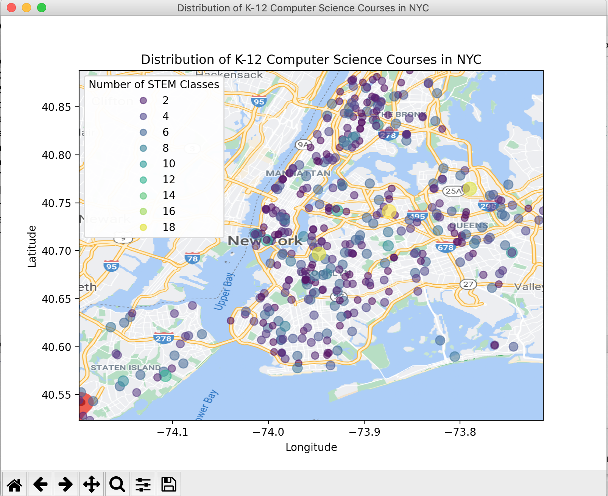

# K-12 Computer Science Course Distribution in NYC Schools
## Using Python to Clean and Visualize the Data

### My Process
1. Data discovery: In perusing the data.world site, I discovered this dataset that contained the number of computer science courses at each school in New York City. My goal in creating a data visualzation for this set was to see if any parts of the city could benefit from additional STEM resources.
2. Data cleaning: Some schools had ambiguious names, such as "Concord High" that could easily be misinterpreted by the Google Maps API as schools in other regions, so those data points had their latitudes and longitudes manually calculated.
3. Adding to the data: The orginal CSV file did not contain latitudinal or longitudinal information, so that had to be added to the dataset. The Google Maps Python API was used to geocode (find latitude and longitude) each school in the data set in order to be able to map it, and pandas was used to add the new information to the CSV.
4. Follow up data cleaning: Some data points were clear outliers geographically and had to be removed to maximize the data visualization. A few datapoints got misinterpreted by Google Maps as schools in different regions, even after the initial data cleaning, and their coordinates were manually corrected.
5. Setting plot boundaries: The max and min of latitude and longitude were calculated by looping through the CSV, to determine the latitudinal and longitudinal boundaries for the scatterplot.
6. Plotting: The points were plotted geographically using a matplotlib scatterplot overlaid on a map of NYC. The color and size of each point was determined based upon how many computer science courses each school had, with larger points representing more CS courses.
7. Final touches: A legend was added to make the data easier to understand and interpret based on the color of each plot point.

### Final Product

### Python File Explanation
- gettingLatLong.py : uses the Google Maps API to geocode the list of school names from data set and adds the corresponding latitudes and longitudes to the CSV
- getMaxLat.py : calculates the max and min of the latitudes and longitudes in order to set proper boundaries for the plot
- mappingSTEM.py : takes the cleaned data and maps it in a scatterplot overlaid on a map of NYC

### Dependencies
The following Python libraries are necessary to run this code: pandas, matplotlib, and requests- each can be added though pip or conda
